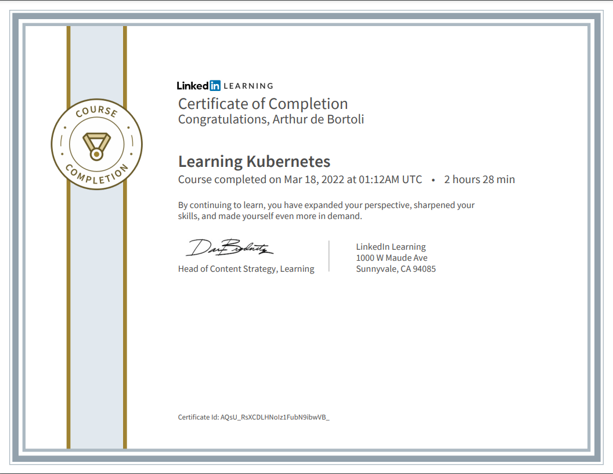

# Kubernetes Training

This repository contains my personal notes and exercise files used while I was doing the [Learning Kubernetes](https://www.linkedin.com/learning/learning-kubernetes/welcome?autoplay=true&u=57692769) course on Linkedin Learning, by [Karthik Gaekwad](https://github.com/karthequian).

### [Course Repository by Karthik](https://github.com/karthequian/Kubernetes)

## Studies folder

Contains all my notes (in portuguese) done while doing the course. The [concepts.md ](https://github.com/Arthurdb1999/kubernetes-trainning/blob/master/studies/concepts.md) and [advanced.md](https://github.com/Arthurdb1999/kubernetes-trainning/blob/master/studies/advanced.md) files contains general notes. The [installation.md](https://github.com/Arthurdb1999/kubernetes-trainning/blob/master/studies/installation.md) file contains instructions on how to install Kubernetes and all the tools needed in the course, on Windows.

## Exercises folder

Contains all the yaml files used in the course, the instruction on how to use them are on the [tutorial.md](https://github.com/Arthurdb1999/kubernetes-trainning/blob/master/studies/tutorial.md) file.

## Course Certificate

