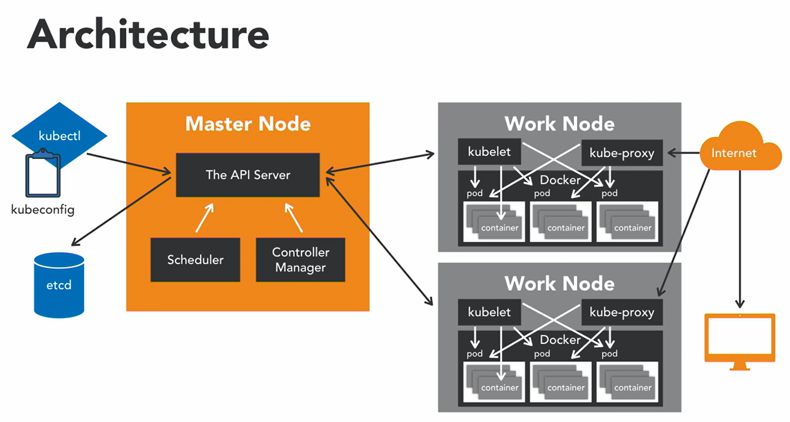

# Kubernetes

É um orquestrador de Containers, responsável por:

- Prover hosts de serviço e instanciar containers dentro desses hosts;

- Rebootar containers em falha;

- Escalar o cluster para cima ou para baixo;

- Expor os containers como serviços fora do cluster;

- Agendar a execução de containers dentro de um cluster.

## Features

- Multi-Host Container Scheduling: vincula pods em nodos em tempo de execução. Antes de vincular, checa recursos disponíveis, qualidade de serviço, especificação e etc.

- Escalabilidade: suporte 5K nodos em um cluster e 150k de pods, sendo até 100 pods por nodo. Pods podem ser escalados horizontalmente.

- Flexibilidade e Modularização: easy to use, com possibilidade de criação de add-ons para facilitar as tarefas, como visualização, tempo de execução e etc. 

- Nodos "órfãos" se registram automaticamente no master nodo.

- Armazenamento persistente: Pods podem utilizar volumes de persistência para armazenar dados. Os dados sao mantidos mesmo após reboots de pods ou crashes.

- Upgrade e Downgrade da aplicação: rollback ou upgrade da versão da aplicação utilizada.

- Logs e Monitoramento: checks de containers e de nodos, com falhas sendo monitoradas por um nodo controlador.

## Concorrentes

Docker Swarm, Rancher, Mesos, Amazon EC2, Google Anthos

## Arquitetura

- Master Node: É o que gerencia tudo no cluster, e tem 3 componentes principais para isso: API Server, Scheduler e Controller Manager

    - Scheduler: vincula os pods a um nodo específico, para que possam rodar

    - Controller Manager: rodam os controllers, que são background threads que rodam tasks dentro de um cluster.

        - Node controller: responsável pelos estados dos workers;

        - Replication controller: responsável por manter o número correto de pods;

        - Endpoint controller: junta serviços com os pods, como controle de acesso por exemplo.

- etcd: armazenamento simples de dados chaves-valor, utilizado para manter a configuração do cluster, como por exemplo agendamento de tarefas, informações dos pods, etc.

- kubectl: CLI para controllar o Master Node. Possui o kubeconfig, que prove as informações de acesso ao cluster.

- Worker Nodes: Comunicam com o Master Node através do kubelet, e possuem a aplicação rodando. Um nodo é a máquina onde a aplicação está rodando, podendo ser um computador físico ou uma máquina virtual.

    - kubelet: Executa os pods container através dos containers engines, verifica se os pods foram vinculados aos nodos, monta e executa o os volumes dos pods com os secrets, e possui informação sobre os status dos pods.

    - kube-proxy: age como o proxy e load balancer de um Worker Node.

    - Docker: roda os containers, que são amarrados dentro de um pod. Esse grupo de containers compartilham o mesmo endereço IP, armazenamento, etc.

    - Pod: é a menor unidade que pode ser agendada para deploy no Kubernetes. Pode-se criar, fazer deploy ou excluir pods, e representa um processo rodando dentro do cluster.

        - Contém o(s) container(s) Docker, recursos de armazenamento, IP único e opções para rodar os containers.

        - São efêmeros, nunca voltam a funcionar sozinhos depois de uma falha ou se auto criam.

        - São feitos para serem utilizados com um controller para gerenciá-los.

        - Estados de um Pod: **Pending, Running, Succeeded, Failed, CrashLoopBackOff**.

Depois que o deploy dos pods foi feito, o kubelet e o kube-proxy começam a deixar o serviço online, disparando requisições aos pods.

## Controllers

Fazem:

- Confiabilidade da Aplicação: previne problemas caso uma ou mais instâncias falhem;

- Aumento de pods para suprir a demanda

- Load Balancing

### Tipos de Controllers

- ReplicaSets

    - Assegura que todas as réplicas de um pod estão executando todo tempo. Se um pod morrer, o ReplicaSet vai criar um novo pod com a ajuda de um Deployment Controller.

- Deployments

    - Podemos adicionar as configurações de deploy em um arquivo yaml. Essa configuração pode conter instruções para criar novos ReplicaSets ou susbtituir existentes por novos.

    - Gerencia as ReplicaSets, que por sua vez, gerencia um pod.

    - Pode-se pausar um deployment, fazer alterações, e continuar o deployment depois.

    - Status de Deployment.

    - Replication Controller: é um controller deprecated que foi substituído pelos Deployments e ReplicaSet Controllers

- DaemonSets

    - Assegura que todos os nodos executem a cópia de um pod específico.

    - A medida que novos nodos são adicionados ou removidos do cluster, um DaemonSet adiciona ou remove os pods necessários.

- Jobs

    - Supervisiona os pods em estado de conclusão.

    - Podem ser Cron Jobs, ou seja, processos que rodam uma vez e completam com sucesso.

- Services

    - Permite a comunicação entre um conjunto de deployments com outro, ou seja, comunicação entre um ou mais pods do cluster.

    - Internal: onde o IP só pode ser acessado dentro do cluster.

    - External: chama-se NodePort no Kubernetes. Provê um endpoint externo para comunicação.

## Labels, selectores e namespaces

- Labels: são chaves-valor vinculados a objetos, como pods, services ou deployments. Basicamente é o nome do objeto pro usuário poder identificar.

- Selectors: dá super powers para as labels.

    - Permite a identificação de um conjunto de objetos.

    - Equality-based e set-based - operadores (igual, diferente, in, notin, exists).

    - Label selectors são utilizados no kubectl para procurar por objetos.

- Namespaces

    - Permite que tenhamos múltiplos cluster virtuais escondidos atrás do mesmo cluster físico.

    - Utiliza-se para dividir os times, onde cada time tem a sua application. Bom para dividir os recursos do cluster entre os usuários.

## Kubelet e Kube-proxy

- Kubelet

    - É configurado através do arquivo Podspec.yaml, que descreve um pod.

    - Só gerencia containers criados pela API Server, e não outros containers que possam estar rodando no nodo.

- Kube-proxy

    - User space mode, Iptables mode e Ipvs mode.

    - Supervisiona a API server na adição ou remoção de Services. Para cada novo Service, o kube-proxy abre uma porta aleatória no nodo.